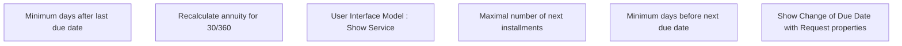

# Show Change of Due Date with Request properties

```mermaid
graph TD
    Minimum_days_after_last_due_date["Minimum days after last due date"]
    Recalculate_annuity_for_30_360["Recalculate annuity for 30/360"]
    User_Interface_Model_Show_Service["User Interface Model : Show Service"]
    Maximal_number_of_next_installments["Maximal number of next installments"]
    Minimum_days_before_next_due_date["Minimum days before next due date"]
    Show_Change_of_Due_Date_with_Request_properties["Show Change of Due Date with Request properties"]
```
