# Show Consolidation properties

- **Diagram Type**: Custom
- **Package**: HomerSelect/BSL/Modules/Product Catalog (PRC)/Analytical Model/Service/User Interface for Service Management/Service Type Specific Extension/CONS/User Interface
- **Diagram ID**: 103805
- **Elements**: 19
- **Connectors**: 0

```mermaid
graph TD
    External_Refinancing["External Refinancing"]
    Internal_Refinancing["Internal Refinancing"]
    Used_for["Used for"]
    Used_for["Used for:"]
    External_Loans_Repayment_Period_Days["External Loans Repayment Period Days"]
    Products_for_consolidation["Products for consolidation:"]
    Expiration_Period_Days["Expiration Period Days"]
    FER_Service["FER Service"]
    CEL_POS["CEL POS"]
    CEL_CASH["CEL CASH"]
    Products_for_consolidation["Products for consolidation"]
    User_Interface_Model_Show_Service["User Interface Model : Show Service"]
    Maximal_Disbursement_Amount["Maximal Disbursement Amount"]
    Minimal_Disbursement_Amount["Minimal Disbursement Amount"]
    Minimal_Consolidation_Amount["Minimal Consolidation Amount"]
    Maximal_Consolidation_Amount["Maximal Consolidation Amount"]
    Interest_and_Fee_Calculation_Method["Interest and Fee Calculation Method"]
    Consolidation_Type["Consolidation Type"]
    Show_Consolidation_properties["Show Consolidation properties"]
```

