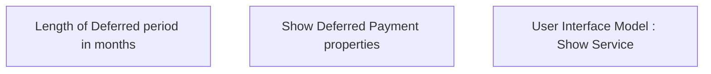

# Show Deferred Payment properties

```mermaid
graph TD
    Length_of_Deferred_period_in_months["Length of Deferred period in months"]
    Show_Deferred_Payment_properties["Show Deferred Payment properties"]
    User_Interface_Model_Show_Service["User Interface Model : Show Service"]
```
