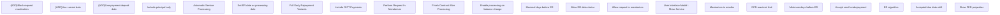

# Show FER properties

```mermaid
graph TD
    ADD_Block_request_reactivation["{ADD}Block request reactivation"]
    ADD_Use_current_date["{ADD}Use current date"]
    ADD_Use_payment_deposit_date["{ADD}Use payment deposit date"]
    Include_principal_only["Include principal only"]
    Automatic_Service_Processing["Automatic Service Processing"]
    Set_ER_date_as_processing_date["Set ER date as processing date"]
    Full_Early_Repayment_Variants["Full Early Repayment Variants"]
    Include_GIFT_Payments["Include GIFT Payments"]
    Perform_Request_In_Moratorium["Perform Request In Moratorium"]
    Finish_Contract_After_Processing["Finish Contract After Processing"]
    Enable_processing_on_balance_change["Enable processing on balance change"]
    Maximal_days_before_ER["Maximal days before ER"]
    Allow_ER_date_choice["Allow ER date choice"]
    Allow_request_in_moratorium["Allow request in moratorium"]
    User_Interface_Model_Show_Service["User Interface Model : Show Service"]
    Moratorium_in_months["Moratorium in months"]
    DPD_maximal_limit["DPD maximal limit"]
    Minimum_days_before_ER["Minimum days before ER"]
    Accept_small_underpayment["Accept small underpayment"]
    ER_algorithm["ER algorithm"]
    Accepted_due_date_shift["Accepted due date shift"]
    Show_FER_properties["Show FER properties"]
```
