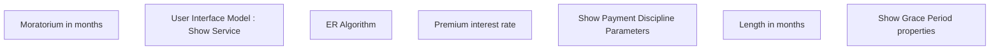

# Show Grace Period properties

```mermaid
graph TD
    Moratorium_in_months["Moratorium in months"]
    User_Interface_Model_Show_Service["User Interface Model : Show Service"]
    ER_Algorithm["ER Algorithm"]
    Premium_interest_rate["Premium interest rate"]
    Show_Payment_Discipline_Parameters["Show Payment Discipline Parameters"]
    Length_in_months["Length in months"]
    Show_Grace_Period_properties["Show Grace Period properties"]
```
