# Show Loan Restructuring properties

- **Diagram Type**: Custom
- **Package**: HomerSelect/BSL/Modules/Product Catalog (PRC)/Analytical Model/Service/User Interface for Service Management/Service Type Specific Extension/LRES/User Interface
- **Diagram ID**: 128658
- **Elements**: 7
- **Connectors**: 0

```mermaid
graph TD
    ADD_Keep_installment_amount["{ADD}Keep installment amount"]
    Min_Days_Before_Installment["Min Days Before Installment"]
    Expiration_Period_Days["Expiration Period Days"]
    Bonus_Services_Impact["Bonus Services Impact"]
    Accept_small_underpayment["Accept small underpayment"]
    Show_Loan_Restucturing_properties["Show Loan Restucturing properties"]
    User_Interface_Model_Show_Service["User Interface Model : Show Service"]
```

