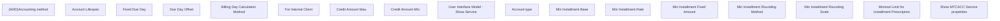

# Show MTCACC Service properties

```mermaid
graph TD
    ADD_Accounting_method["{ADD}Accounting method"]
    Account_Lifespan["Account Lifespan"]
    Fixed_Due_Day["Fixed Due Day"]
    Due_Day_Offset["Due Day Offset"]
    Billing_Day_Calculation_Method["Billing Day Calculation Method"]
    For_Internal_Client["For Internal Client
"]
    Credit_Amount_Max["Credit Amount Max."]
    Credit_Amount_Min["Credit Amount Min."]
    User_Interface_Model_Show_Service["User Interface Model : Show Service"]
    Account_type["Account type"]
    Min_Installment_Base["Min Installment Base"]
    Min_Installment_Rate["Min Installment Rate"]
    Min_Installment_Fixed_Amount["Min Installment Fixed Amount"]
    Min_Installment_Rounding_Method["Min Installment Rounding Method"]
    Min_Installment_Rounding_Scale["Min Installment Rounding Scale"]
    Minimal_Limit_for_Installment_Prescription["Minimal Limit for Installment Prescription"]
    Show_MTCACC_Service_properties["Show MTCACC Service properties"]
```
