# Show Payment Discipline Parameters

- **Diagram Type**: Custom
- **Package**: HomerSelect/BSL/Modules/Product Catalog (PRC)/Analytical Model/Service/User Interface for Service Management/Service Type Specific Extension/Payment Discipline/User Interface
- **Diagram ID**: 131907
- **Elements**: 8
- **Connectors**: 0

```mermaid
graph TD
    Differ_Tolerance_for_Last_DPD["Differ Tolerance for Last DPD"]
    DPD_Amount_Tolerance["DPD Amount Tolerance"]
    Last_DPD_Amount_Tolerance["Last DPD Amount Tolerance"]
    Last_DPD_Delay_Tolerance["Last DPD Delay Tolerance"]
    DPD_Tolerance["DPD Tolerance"]
    DPD_Scope["DPD Scope"]
    DPD_Delay_Tolerance["DPD Delay Tolerance"]
    Payment_Discipline_parameters_display["Payment Discipline parameters - display"]
```

