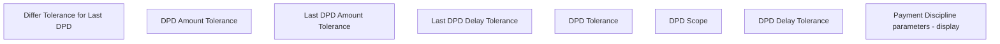

# Show Payment Discipline Parameters

```mermaid
graph TD
    Differ_Tolerance_for_Last_DPD["Differ Tolerance for Last DPD"]
    DPD_Amount_Tolerance["DPD Amount Tolerance"]
    Last_DPD_Amount_Tolerance["Last DPD Amount Tolerance"]
    Last_DPD_Delay_Tolerance["Last DPD Delay Tolerance"]
    DPD_Tolerance["DPD Tolerance"]
    DPD_Scope["DPD Scope"]
    DPD_Delay_Tolerance["DPD Delay Tolerance"]
    Payment_Discipline_parameters_display["Payment Discipline parameters - display"]
```
