# Show Payment Holidays properties

- **Diagram Type**: Custom
- **Package**: HomerSelect/BSL/Modules/Product Catalog (PRC)/Analytical Model/Service/User Interface for Service Management/Service Type Specific Extension/PAYHOL/User Interface
- **Diagram ID**: 142424
- **Elements**: 9
- **Connectors**: 0

```mermaid
graph TD
    DEL_Interest_Accrual_Calculation["{DEL}Interest Accrual Calculation"]
    DEL_Interest_calculation["{DEL}Interest calculation"]
    Bonus_Services_Impact["Bonus Services Impact"]
    Accept_small_underpayment["Accept small underpayment"]
    Expiration_Period_Days["Expiration Period Days"]
    Min_Days_Before_Installment["Min Days Before Installment"]
    Max_Number_of_Deferred_Periods["Max Number of Deferred Periods"]
    User_Interface_Model_Show_Service["User Interface Model : Show Service"]
    Show_Payment_Holidays_properties["Show Payment Holidays properties"]
```

