# Show REL Payment Holidays Properties

- **Diagram Type**: Custom
- **Package**: HomerSelect/BSL/Modules/Product Catalog (PRC)/Analytical Model/Service/User Interface for Service Management/Service Type Specific Extension/RELPAYHOL/User Interface
- **Diagram ID**: 128072
- **Elements**: 9
- **Connectors**: 0

```mermaid
graph TD
    ADD_Installment_Plan_Accrue_Interest_During_Deferred_Periods["{ADD}Installment Plan Accrue Interest During Deferred Periods"]
    diagram_9325C652_39F9_4888_ADB1_14F5BD0A4522["$diagram://{9325C652-39F9-4888-ADB1-14F5BD0A4522}"]
    Block_account_during_Deferred_periods["Block account during Deferred periods"]
    MOD_Balance_Accrue_Interest_During_Deferred_Periods["{MOD}Balance Accrue Interest During Deferred Periods"]
    Time_period_in_years["Time period in years"]
    Max_number_of_Deferred_periods_in_time_period["Max number of Deferred periods in time period"]
    Min_months_between_Deferred_periods["Min months between Deferred periods"]
    Max_number_of_Deferred_periods["Max number of Deferred periods"]
    Show_REL_Payment_Holidays_Properties["Show REL Payment Holidays Properties"]
```

