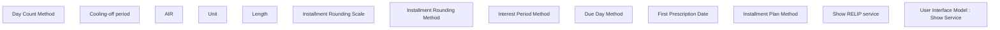

# Show RELIP service

```mermaid
graph TD
    Day_Count_Method["Day Count Method"]
    Cooling_off_period["Cooling-off period"]
    AIR["AIR"]
    Unit["Unit"]
    Length["Length"]
    Installment_Rounding_Scale["Installment Rounding Scale"]
    Installment_Rounding_Method["Installment Rounding Method"]
    Interest_Period_Method["Interest Period Method"]
    Due_Day_Method["Due Day Method"]
    First_Prescription_Date["First Prescription Date"]
    Installment_Plan_Method["Installment Plan Method"]
    Show_RELIP_service["Show RELIP service "]
    User_Interface_Model_Show_Service["User Interface Model : Show Service"]
```
