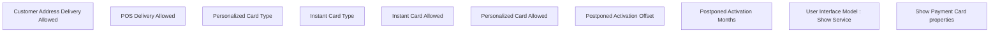

# Show Standard Payment Card properties

```mermaid
graph TD
    Customer_Address_Delivery_Allowed["Customer Address Delivery Allowed"]
    POS_Delivery_Allowed["POS Delivery Allowed"]
    Personalized_Card_Type["Personalized Card Type"]
    Instant_Card_Type["Instant Card Type"]
    Instant_Card_Allowed["Instant Card Allowed"]
    Personalized_Card_Allowed["Personalized Card Allowed"]
    Postponed_Activation_Offset["Postponed Activation Offset"]
    Postponed_Activation_Months["Postponed Activation Months"]
    User_Interface_Model_Show_Service["User Interface Model : Show Service"]
    Show_Payment_Card_properties["Show Payment Card properties"]
```
