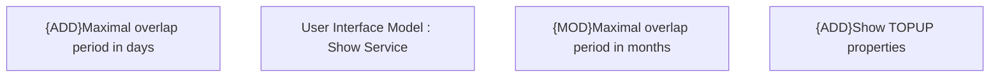

# Show TOPUP properties

```mermaid
graph TD
    ADD_Maximal_overlap_period_in_days["{ADD}Maximal overlap period in days"]
    User_Interface_Model_Show_Service["User Interface Model : Show Service"]
    MOD_Maximal_overlap_period_in_months["{MOD}Maximal overlap period in months"]
    ADD_Show_TOPUP_properties["{ADD}Show TOPUP properties"]
```
