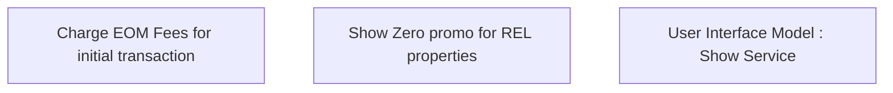

# Show Zero promo for REL properties

```mermaid
graph TD
    Charge_EOM_Fees_for_initial_transaction["Charge EOM Fees for initial transaction"]
    Show_Zero_promo_for_REL_properties["Show Zero promo for REL properties"]
    User_Interface_Model_Show_Service["User Interface Model : Show Service"]
```
