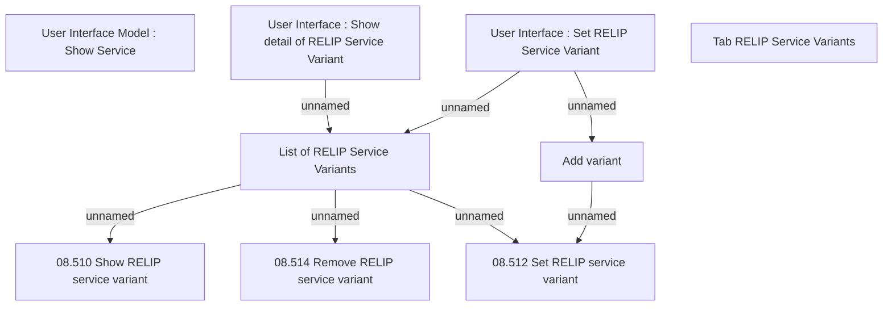

# Tab RELIP Service Variant

```mermaid
graph TD
    User_Interface_Model_Show_Service["User Interface Model : Show Service"]
    User_Interface_Show_detail_of_RELIP_Service_Variant["User Interface : Show detail of RELIP Service Variant"]
    User_Interface_Set_RELIP_Service_Variant["User Interface : Set RELIP Service Variant"]
    n_08_512_Set_RELIP_service_variant["08.512 Set RELIP service variant"]
    n_08_514_Remove_RELIP_service_variant["08.514 Remove RELIP service variant"]
    n_08_510_Show_RELIP_service_variant["08.510 Show RELIP service variant"]
    Add_variant["Add variant"]
    List_of_RELIP_Service_Variants["List of RELIP Service Variants"]
    Tab_RELIP_Service_Variants["Tab RELIP Service Variants"]
    User_Interface_Show_detail_of_RELIP_Service_Variant -->|unnamed| List_of_RELIP_Service_Variants
    User_Interface_Set_RELIP_Service_Variant -->|unnamed| List_of_RELIP_Service_Variants
    User_Interface_Set_RELIP_Service_Variant -->|unnamed| Add_variant
    List_of_RELIP_Service_Variants -->|unnamed| n_08_510_Show_RELIP_service_variant
    List_of_RELIP_Service_Variants -->|unnamed| n_08_514_Remove_RELIP_service_variant
    Add_variant -->|unnamed| n_08_512_Set_RELIP_service_variant
    List_of_RELIP_Service_Variants -->|unnamed| n_08_512_Set_RELIP_service_variant
```
