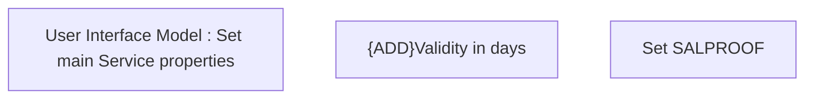

# {ADD}Set SALPROOF Service properties

```mermaid
graph TD
    User_Interface_Model_Set_main_Service_properties["User Interface Model : Set main Service properties"]
    ADD_Validity_in_days["{ADD}Validity in days"]
    Set_SALPROOF["Set SALPROOF"]
```
