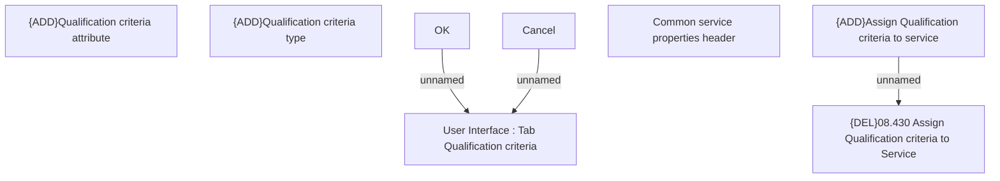

# Qualification criteria - Assign

- **Diagram Type**: Custom
- **Package**: HomerSelect/BSL/Modules/Product Catalog (PRC)/Analytical Model/Service/User Interface for Service Management/{ADD}Qualification criteria/User Interface
- **Diagram ID**: 117028
- **Elements**: 8
- **Connectors**: 3

