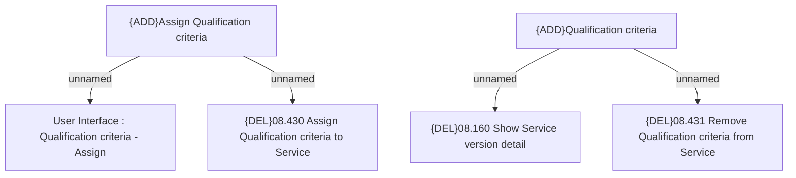

# Tab Qualification criteria

```mermaid
graph TD
    DEL_08_160_Show_Service_version_detail["{DEL}08.160 Show Service version detail"]
    User_Interface_Qualification_criteria_Assign["User Interface : Qualification criteria - Assign"]
    DEL_08_431_Remove_Qualification_criteria_from_Service["{DEL}08.431 Remove Qualification criteria from Service"]
    DEL_08_430_Assign_Qualification_criteria_to_Service["{DEL}08.430 Assign Qualification criteria to Service"]
    ADD_Assign_Qualification_criteria["{ADD}Assign Qualification criteria"]
    ADD_Qualification_criteria["{ADD}Qualification criteria"]
    ADD_Qualification_criteria["{ADD}Qualification criteria"]
    ADD_Qualification_criteria -->|unnamed| DEL_08_160_Show_Service_version_detail
    ADD_Assign_Qualification_criteria -->|unnamed| User_Interface_Qualification_criteria_Assign
    ADD_Qualification_criteria -->|unnamed| DEL_08_431_Remove_Qualification_criteria_from_Service
    ADD_Assign_Qualification_criteria -->|unnamed| DEL_08_430_Assign_Qualification_criteria_to_Service
```
