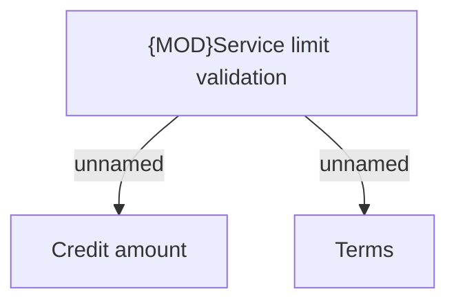

# Validation Rules

- **Diagram Type**: Custom
- **Package**: HomerSelect/BSL/Modules/Product Catalog (PRC)/Analytical Model/Service/User Interface for Service Management/{ADD}Service Limit/Validation Rules
- **Diagram ID**: 147040
- **Elements**: 3
- **Connectors**: 2

