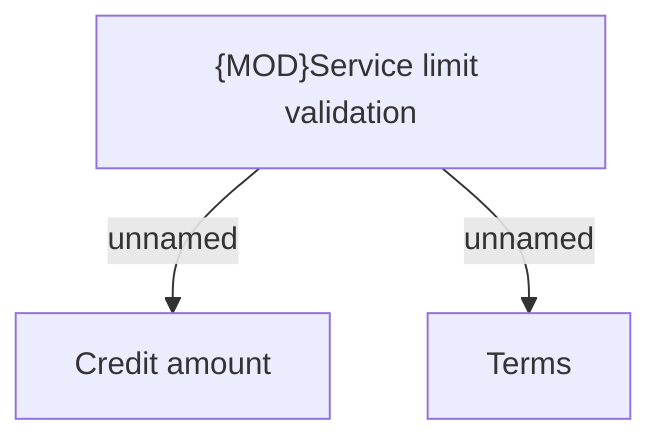

# Validation Rules

```mermaid
graph TD
    Credit_amount["Credit amount"]
    Terms["Terms"]
    MOD_Service_limit_validation["{MOD}Service limit validation"]
    MOD_Service_limit_validation -->|unnamed| Credit_amount
    MOD_Service_limit_validation -->|unnamed| Terms
```
