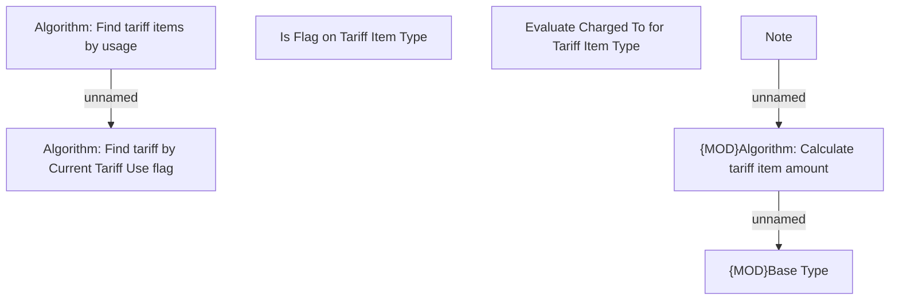

# Business Rules

- **Diagram Type**: Custom
- **Package**: HomerSelect/BSL/Modules/Product Catalog (PRC)/Analytical Model/Tariff/Tariff Calculation/Business Rules
- **Diagram ID**: 164438
- **Elements**: 7
- **Connectors**: 3

