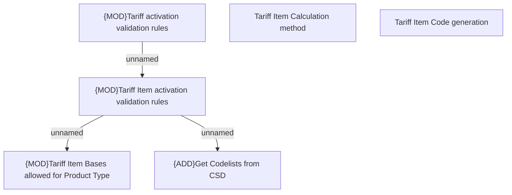

# Business Rules

```mermaid
graph TD
    ADD_Get_Codelists_from_CSD["{ADD}Get Codelists from CSD"]
    MOD_Tariff_activation_validation_rules["{MOD}Tariff activation validation rules"]
    MOD_Tariff_Item_Bases_allowed_for_Product_Type["{MOD}Tariff Item Bases allowed for Product Type"]
    MOD_Tariff_Item_activation_validation_rules["{MOD}Tariff Item activation validation rules"]
    Tariff_Item_Calculation_method["Tariff Item Calculation method "]
    Tariff_Item_Code_generation["Tariff Item Code generation"]
    MOD_Tariff_activation_validation_rules -->|unnamed| MOD_Tariff_Item_activation_validation_rules
    MOD_Tariff_Item_activation_validation_rules -->|unnamed| MOD_Tariff_Item_Bases_allowed_for_Product_Type
    MOD_Tariff_Item_activation_validation_rules -->|unnamed| ADD_Get_Codelists_from_CSD
```
