# Set Tariff Item

- **Diagram Type**: Custom
- **Package**: HomerSelect/BSL/Modules/Product Catalog (PRC)/Analytical Model/Tariff/User Interface for Tariff Management/Tariff Item/User Interface
- **Diagram ID**: 163122
- **Elements**: 30
- **Connectors**: 2

```mermaid
graph TD
    ADD_Divide_by_terms["{ADD}Divide by terms"]
    Text_to_display["Text to display"]
    Limit_value["Limit value"]
    Limit_value_based_on["Limit value based on"]
    Minimal_amount_to_zero["Minimal amount to zero "]
    Group["Group"]
    Limit_number_based_on["Limit number based on"]
    Annual_rate_projection["Annual rate projection "]
    DEL_04_040_Update_tariff_item["{DEL}04.040 Update tariff item"]
    DEL_04_020_Create_tariff_item["{DEL}04.020 Create tariff item"]
    Cancel["Cancel"]
    Tax["Tax"]
    Save["Save"]
    Maximal_amount_of_fee["Maximal amount of fee"]
    Limit_amount_to["Limit amount to"]
    Minimal_amount_of_fee["Minimal amount of fee"]
    Rounding_scale["Rounding scale"]
    Rounding["Rounding"]
    Percentage_based_on["Percentage based on"]
    Percentage_rate["Percentage rate"]
    MOD_Percentage["{MOD}Percentage"]
    Limit_amount_from["Limit amount from"]
    Limit_amount_based_on["Limit amount based on"]
    Fixed_amount["Fixed amount"]
    Calculation_method["Calculation method"]
    Category["Category"]
    Type["Type"]
    Limit_number_from["Limit number from"]
    Limit_number_to["Limit number to"]
    Create_tariff_item["Create tariff item"]
    Create_tariff_item -->|unnamed| DEL_04_020_Create_tariff_item
    Create_tariff_item -->|unnamed| DEL_04_040_Update_tariff_item
```

