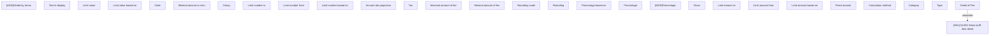

# Tariff Item detail

```mermaid
graph TD
    ADD_Divide_by_terms["{ADD}Divide by terms"]
    Text_to_display["Text to display"]
    Limit_value["Limit value"]
    Limit_value_based_on["Limit value based on"]
    Code["Code"]
    Minimal_amount_to_zero["Minimal amount to zero"]
    Group["Group"]
    Limit_number_to["Limit number to"]
    Limit_number_from["Limit number from"]
    Limit_number_based_on["Limit number based on"]
    Annual_rate_projection["Annual rate projection "]
    DEL_04_050_Show_tariff_item_detail["{DEL}04.050 Show tariff item detail"]
    Tax["Tax"]
    Maximal_amount_of_fee["Maximal amount of fee"]
    Minimal_amount_of_fee["Minimal amount of fee"]
    Rounding_scale["Rounding scale"]
    Rounding["Rounding"]
    Percentage_based_on["Percentage based on"]
    Percentage["Percentage"]
    MOD_Percentage["{MOD}Percentage"]
    Close["Close"]
    Limit_amount_to["Limit amount to"]
    Limit_amount_from["Limit amount from"]
    Limit_amount_based_on["Limit amount based on"]
    Fixed_amount["Fixed amount"]
    Calculation_method["Calculation method"]
    Category["Category"]
    Type["Type"]
    Detail_of_Fee["Detail of Fee"]
    Detail_of_Fee -->|unnamed| DEL_04_050_Show_tariff_item_detail
```
