# Access Rights

- **Diagram Type**: Custom
- **Package**: HomerSelect/BSL/Modules/Product Catalog (PRC)/Analytical Model/Tariff/User Interface for Tariff Management/Tariff Root/Access Rights
- **Diagram ID**: 162639
- **Elements**: 19
- **Connectors**: 10

```mermaid
graph TD
    n_04_180_Activate_Tariff_version["04.180 Activate Tariff version"]
    n_04_170_Cancel_Tariff_version["04.170 Cancel Tariff version"]
    n_04_160_Create_Tariff_version["04.160 Create Tariff version"]
    n_04_180_Activate_Tariff_version_manually["04.180 Activate Tariff version manually"]
    n_04_190_Activate_Tariff_version_automatically["04.190 Activate Tariff version automatically"]
    DEL_04_170_Cancel_Tariff_version["{DEL}04.170 Cancel Tariff version"]
    DEL_04_160_Create_Tariff_version["{DEL}04.160 Create Tariff version"]
    DEL_04_180_Activate_Tariff_version_manually["{DEL}04.180 Activate Tariff version manually"]
    n_04_190_Activate_Tariff_version_automatically["04.190 Activate Tariff version automatically"]
    DEL_04_015_Create_tariff_by_copy["{DEL}04.015 Create tariff by copy"]
    DEL_04_015_Create_Tariff_by_copy["{DEL}04.015 Create Tariff by copy"]
    n_04_060_Set_main_Tariff_properties["04.060 Set main Tariff properties"]
    DEL_04_010_Create_tariff["{DEL}04.010 Create tariff"]
    DEL_04_070_Show_Tariff_version_detail["{DEL}04.070 Show Tariff version detail"]
    n_04_090_Search_for_tariffs["04.090 Search for tariffs"]
    DEL_04_090_Search_for_Tariffs["{DEL}04.090 Search for Tariffs"]
    DEL_04_060_Set_main_Tariff_properties["{DEL}04.060 Set main Tariff properties"]
    DEL_04_010_Create_Tariff["{DEL}04.010 Create Tariff"]
    DEL_04_070_Show_Tariff_version_detail["{DEL}04.070 Show Tariff version detail"]
    DEL_04_090_Search_for_Tariffs -->|unnamed| n_04_090_Search_for_tariffs
    DEL_04_070_Show_Tariff_version_detail -->|unnamed| DEL_04_070_Show_Tariff_version_detail
    DEL_04_010_Create_Tariff -->|unnamed| DEL_04_010_Create_tariff
    DEL_04_060_Set_main_Tariff_properties -->|unnamed| n_04_060_Set_main_Tariff_properties
    DEL_04_015_Create_Tariff_by_copy -->|unnamed| DEL_04_015_Create_tariff_by_copy
    n_04_190_Activate_Tariff_version_automatically -->|unnamed| n_04_190_Activate_Tariff_version_automatically
    DEL_04_180_Activate_Tariff_version_manually -->|unnamed| n_04_180_Activate_Tariff_version_manually
    DEL_04_160_Create_Tariff_version -->|unnamed| n_04_160_Create_Tariff_version
    DEL_04_170_Cancel_Tariff_version -->|unnamed| n_04_170_Cancel_Tariff_version
    DEL_04_180_Activate_Tariff_version_manually -->|unnamed| n_04_180_Activate_Tariff_version
```

