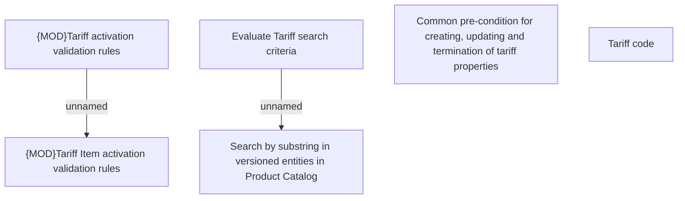

# Business Rules

- **Diagram Type**: Custom
- **Package**: HomerSelect/BSL/Modules/Product Catalog (PRC)/Analytical Model/Tariff/User Interface for Tariff Management/Tariff Root/Business Rules
- **Diagram ID**: 106973
- **Elements**: 6
- **Connectors**: 2

