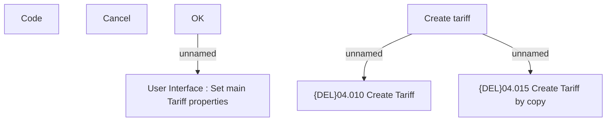

# Create Tariff

- **Diagram Type**: Custom
- **Package**: HomerSelect/BSL/Modules/Product Catalog (PRC)/Analytical Model/Tariff/User Interface for Tariff Management/Tariff Root/User Interface
- **Diagram ID**: 159452
- **Elements**: 7
- **Connectors**: 3

