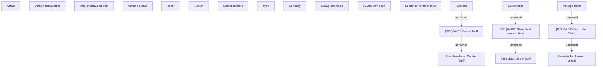

# Search for tariffs

```mermaid
graph TD
    Active["Active"]
    Evaluate_Tariff_search_criteria["Evaluate Tariff search criteria"]
    Version_activated_to["Version activated to"]
    Version_activated_from["Version activated from"]
    Version_Status["Version Status"]
    User_Interface_Create_Tariff["User Interface : Create Tariff"]
    Reset["Reset"]
    Search["Search"]
    Search_buttons["Search buttons"]
    Type["Type"]
    Currency["Currency"]
    MOD_Tariff_name["{MOD}Tariff name"]
    MOD_Tariff_code["{MOD}Tariff code"]
    Search_for_tariffs_criteria["Search for tariffs criteria"]
    Tariff_detail_Show_Tariff["Tariff detail :Show Tariff"]
    DEL_04_070_Show_Tariff_version_detail["{DEL}04.070 Show Tariff version detail"]
    DEL_04_010_Create_Tariff["{DEL}04.010 Create Tariff"]
    DEL_04_090_Search_for_Tariffs["{DEL}04.090 Search for Tariffs"]
    Add_tariff["Add tariff"]
    List_of_tariffs["List of tariffs"]
    Manage_tariffs["Manage tariffs"]
    Manage_tariffs -->|unnamed| DEL_04_090_Search_for_Tariffs
    Add_tariff -->|unnamed| DEL_04_010_Create_Tariff
    List_of_tariffs -->|unnamed| DEL_04_070_Show_Tariff_version_detail
    DEL_04_090_Search_for_Tariffs -->|unnamed| Evaluate_Tariff_search_criteria
    DEL_04_070_Show_Tariff_version_detail -->|unnamed| Tariff_detail_Show_Tariff
    DEL_04_010_Create_Tariff -->|unnamed| User_Interface_Create_Tariff
```
