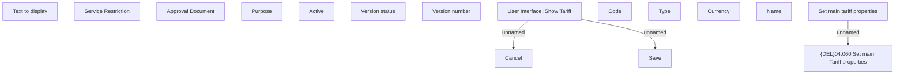

# Set main Tariff properties

```mermaid
graph TD
    Text_to_display["Text to display"]
    Service_Restriction["Service Restriction"]
    Approval_Document["Approval Document"]
    Purpose["Purpose"]
    Active["Active"]
    Version_status["Version status"]
    Version_number["Version number"]
    User_Interface_Show_Tariff["User Interface :Show Tariff"]
    Code["Code"]
    DEL_04_060_Set_main_Tariff_properties["{DEL}04.060 Set main Tariff properties"]
    Type["Type"]
    Currency["Currency"]
    Name["Name"]
    Save["Save"]
    Cancel["Cancel"]
    Set_main_tariff_properties["Set main tariff properties"]
    User_Interface_Show_Tariff -->|unnamed| Cancel
    User_Interface_Show_Tariff -->|unnamed| Save
    Set_main_tariff_properties -->|unnamed| DEL_04_060_Set_main_Tariff_properties
```
