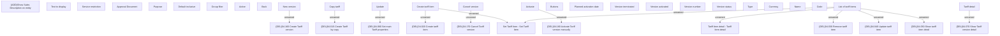

# Show Tariff

```mermaid
graph TD
    ADD_Show_Sales_Description_on_entity["{ADD}Show Sales Description on entity"]
    Text_to_display["Text to display"]
    Service_restriction["Service restriction"]
    Approval_Document["Approval Document"]
    Purpose["Purpose"]
    Default_inclusive["Default inclusive"]
    Group_filter["Group filter"]
    Active["Active"]
    DEL_04_170_Cancel_Tariff_version["{DEL}04.170 Cancel Tariff version"]
    DEL_04_180_Activate_Tariff_version_manually["{DEL}04.180 Activate Tariff version manually"]
    DEL_04_160_Create_Tariff_version["{DEL}04.160 Create Tariff version"]
    DEL_04_015_Create_Tariff_by_copy["{DEL}04.015 Create Tariff by copy"]
    DEL_04_060_Set_main_Tariff_properties["{DEL}04.060 Set main Tariff properties"]
    Back["Back"]
    Create_tariff_item["Create tariff item"]
    New_version["New version"]
    Copy_tariff["Copy tariff"]
    Update["Update"]
    Cancel_version["Cancel version"]
    Activate["Activate"]
    Buttons["Buttons"]
    Planned_activation_date["Planned activation date"]
    Version_terminated["Version terminated"]
    Version_activated["Version activated"]
    Version_number["Version number"]
    Version_status["Version status"]
    Tariff_Item_detail_Tariff_Item_detail["Tariff Item detail : Tariff Item detail"]
    Set_Tariff_Item_Set_Tariff_Item["Set Tariff Item : Set Tariff Item"]
    DEL_04_030_Remove_tariff_item["{DEL}04.030 Remove tariff item"]
    DEL_04_040_Update_tariff_item["{DEL}04.040 Update tariff item"]
    DEL_04_050_Show_tariff_item_detail["{DEL}04.050 Show tariff item detail"]
    DEL_04_020_Create_tariff_item["{DEL}04.020 Create tariff item"]
    DEL_04_070_Show_Tariff_version_detail["{DEL}04.070 Show Tariff version detail"]
    Type["Type"]
    Currency["Currency"]
    Name["Name"]
    Code["Code"]
    List_of_tariff_items["List of tariff items"]
    Tariff_detail["Tariff detail"]
    Tariff_detail -->|unnamed| DEL_04_070_Show_Tariff_version_detail
    Create_tariff_item -->|unnamed| DEL_04_020_Create_tariff_item
    List_of_tariff_items -->|unnamed| DEL_04_050_Show_tariff_item_detail
    List_of_tariff_items -->|unnamed| DEL_04_040_Update_tariff_item
    List_of_tariff_items -->|unnamed| DEL_04_030_Remove_tariff_item
    Create_tariff_item -->|unnamed| Set_Tariff_Item_Set_Tariff_Item
    List_of_tariff_items -->|unnamed| Set_Tariff_Item_Set_Tariff_Item
    List_of_tariff_items -->|unnamed| Tariff_Item_detail_Tariff_Item_detail
    Update -->|unnamed| DEL_04_060_Set_main_Tariff_properties
    Copy_tariff -->|unnamed| DEL_04_015_Create_Tariff_by_copy
    New_version -->|unnamed| DEL_04_160_Create_Tariff_version
    Activate -->|unnamed| DEL_04_180_Activate_Tariff_version_manually
    Cancel_version -->|unnamed| DEL_04_170_Cancel_Tariff_version
```
