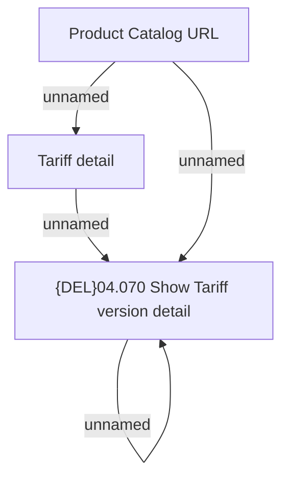

# Tariff Root URL

```mermaid
graph TD
    Tariff_detail["Tariff detail"]
    DEL_04_070_Show_Tariff_version_detail["{DEL}04.070 Show Tariff version detail"]
    DEL_04_070_Show_Tariff_version_detail["{DEL}04.070 Show Tariff version detail"]
    Product_Catalog_URL["Product Catalog URL"]
    Tariff_detail -->|unnamed| DEL_04_070_Show_Tariff_version_detail
    Product_Catalog_URL -->|unnamed| DEL_04_070_Show_Tariff_version_detail
    Product_Catalog_URL -->|unnamed| Tariff_detail
    DEL_04_070_Show_Tariff_version_detail -->|unnamed| DEL_04_070_Show_Tariff_version_detail
```
