# Assign Sales Package Items

- **Diagram Type**: Custom
- **Package**: HomerSelect/BSL/Modules/Product Catalog (PRC)/Analytical Model/{ADD}Sales Package/UI for Sales Package Management/User Interface
- **Diagram ID**: 155353
- **Elements**: 19
- **Connectors**: 4

```mermaid
graph TD
    Service_Type["Service Type"]
    Type["Type"]
    Code["Code"]
    Name["Name"]
    Valid_on["Valid on"]
    Filter_criteria["Filter criteria"]
    Available_Services["Available Services"]
    Search["Search"]
    ADD_Filter_available_sales_package_items_for_an_assignment_t["{ADD}Filter available sales package items for an assignment to sales package"]
    User_Interface_Set_Sales_Package["User Interface : Set Sales Package"]
    Cancel["Cancel"]
    OK["OK"]
    Available_Products["Available Products"]
    Sales_package_code["Sales package code"]
    Valid_To["Valid To"]
    Valid_From["Valid From"]
    Sales_package_name["Sales package name"]
    Assign_Sales_Package_Item_to_Sales_Package["Assign Sales Package Item to Sales Package"]
    Assign_Sales_Package_Items["Assign Sales Package Items"]
    Cancel -->|unnamed| User_Interface_Set_Sales_Package
    OK -->|unnamed| User_Interface_Set_Sales_Package
    Available_Services -->|unnamed| ADD_Filter_available_sales_package_items_for_an_assignment_t
    Available_Products -->|unnamed| ADD_Filter_available_sales_package_items_for_an_assignment_t
```

