# Search Sales Package

- **Diagram Type**: Custom
- **Package**: HomerSelect/BSL/Modules/Product Catalog (PRC)/Analytical Model/{ADD}Sales Package/UI for Sales Package Management/User Interface
- **Diagram ID**: 155350
- **Elements**: 15
- **Connectors**: 3

```mermaid
graph TD
    User_Interface_Set_Sales_Package["User Interface : Set Sales Package"]
    User_Interface_Show_Sales_Package["User Interface : Show Sales Package"]
    DEL_09_311_Create_new_Sales_Package_UI["{DEL}09.311 Create new Sales Package UI"]
    DEL_09_313_Search_Sales_Package_UI["{DEL}09.313 Search Sales Package UI"]
    DEL_09_315_Show_Sales_Package_detail_UI["{DEL}09.315 Show Sales Package detail UI"]
    Active["Active"]
    Reset["Reset"]
    Search["Search"]
    Search_buttons["Search buttons"]
    MOD_Name["{MOD}Name"]
    MOD_Code["{MOD}Code"]
    Search_for_Sales_Packages_criteria["Search for Sales Packages criteria"]
    Create_Sales_Package["Create Sales Package"]
    List_of_Sales_Packages["List of Sales Packages"]
    Search_Sales_Package["Search Sales Package"]
    List_of_Sales_Packages -->|unnamed| DEL_09_315_Show_Sales_Package_detail_UI
    Search_Sales_Package -->|unnamed| DEL_09_313_Search_Sales_Package_UI
    Create_Sales_Package -->|unnamed| DEL_09_311_Create_new_Sales_Package_UI
```

