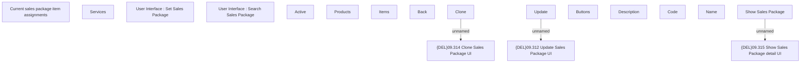

# Show Sales Package

```mermaid
graph TD
    Current_sales_package_item_assignments["Current sales package item assignments"]
    Services["Services"]
    DEL_09_314_Clone_Sales_Package_UI["{DEL}09.314 Clone Sales Package UI"]
    DEL_09_312_Update_Sales_Package_UI["{DEL}09.312 Update Sales Package UI"]
    DEL_09_315_Show_Sales_Package_detail_UI["{DEL}09.315 Show Sales Package detail UI"]
    User_Interface_Set_Sales_Package["User Interface : Set Sales Package"]
    User_Interface_Search_Sales_Package["User Interface : Search Sales Package"]
    Active["Active"]
    Products["Products"]
    Items["Items"]
    Back["Back"]
    Clone["Clone"]
    Update["Update"]
    Buttons["Buttons"]
    Description["Description"]
    Code["Code"]
    Name["Name"]
    Show_Sales_Package["Show Sales Package"]
    Show_Sales_Package -->|unnamed| DEL_09_315_Show_Sales_Package_detail_UI
    Update -->|unnamed| DEL_09_312_Update_Sales_Package_UI
    Clone -->|unnamed| DEL_09_314_Clone_Sales_Package_UI
```
