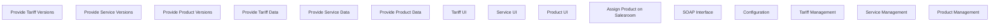

# PCG

- **Diagram Type**: Custom
- **Package**: HomerSelect/BSL/Modules/Product Catalog (PRC)/Documentation/PCG
- **Diagram ID**: 105958
- **Elements**: 15
- **Connectors**: 0

```mermaid
graph TD
    Provide_Tariff_Versions["Provide Tariff Versions"]
    Provide_Service_Versions["Provide Service Versions"]
    Provide_Product_Versions["Provide Product Versions"]
    Provide_Tariff_Data["Provide Tariff Data"]
    Provide_Service_Data["Provide Service Data"]
    Provide_Product_Data["Provide Product Data"]
    Tariff_UI["Tariff UI"]
    Service_UI["Service UI"]
    Product_UI["Product UI"]
    Assign_Product_on_Salesroom["Assign Product on Salesroom"]
    SOAP_Interface["SOAP Interface"]
    Configuration["Configuration"]
    Tariff_Management["Tariff Management"]
    Service_Management["Service Management"]
    Product_Management["Product Management"]
```
