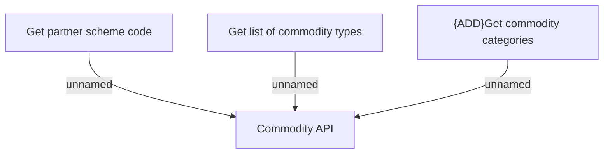

# Business Rules

```mermaid
graph TD
    ADD_Get_commodity_categories["{ADD}Get commodity categories"]
    Get_partner_scheme_code["Get partner scheme code"]
    Commodity_API["Commodity API"]
    Get_list_of_commodity_types["Get list of commodity types"]
    Get_partner_scheme_code -->|unnamed| Commodity_API
    Get_list_of_commodity_types -->|unnamed| Commodity_API
    ADD_Get_commodity_categories -->|unnamed| Commodity_API
```
