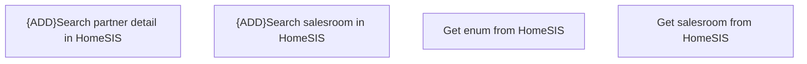

# Business Rules

- **Diagram Type**: Custom
- **Package**: HomerSelect/BSL/Modules/Product Catalog (PRC)/Interface Consumed/HomeSIS API/Business Rules
- **Diagram ID**: 163836
- **Elements**: 4
- **Connectors**: 0

