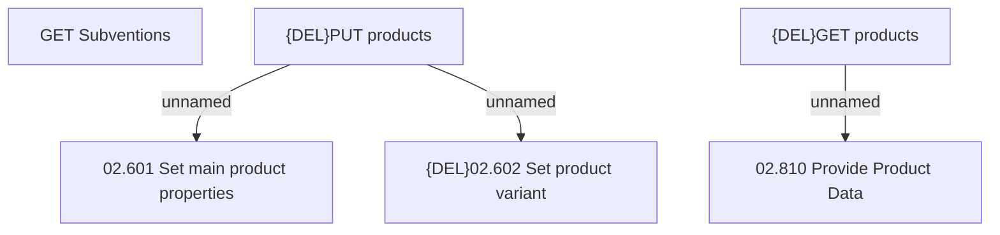

# Access Rights

- **Diagram Type**: Custom
- **Package**: HomerSelect/BSL/Modules/Product Catalog (PRC)/Interface Provided/Product Catalog API in BSL/Access Rights
- **Diagram ID**: 144256
- **Elements**: 6
- **Connectors**: 3

