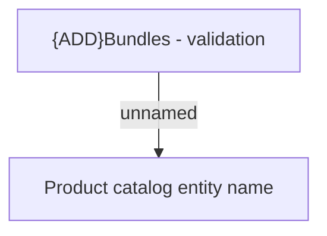

# Validation Rules

```mermaid
graph TD
    Product_catalog_entity_name["Product catalog entity name"]
    ADD_Bundles_validation["{ADD}Bundles - validation"]
    ADD_Bundles_validation -->|unnamed| Product_catalog_entity_name
```
