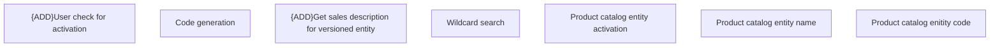

# COMMON for Product catalog REST API

```mermaid
graph TD
    ADD_User_check_for_activation["{ADD}User check for activation"]
    Code_generation["Code generation"]
    ADD_Get_sales_description_for_versioned_entity["{ADD}Get sales description for versioned entity"]
    Wildcard_search["Wildcard search"]
    Product_catalog_entity_activation["Product catalog entity activation"]
    Product_catalog_entity_name["Product catalog entity name"]
    Product_catalog_enitity_code["Product catalog enitity code"]
```
