# Access Rights

- **Diagram Type**: Custom
- **Package**: HomerSelect/BSL/Modules/Product Catalog (PRC)/Interface Provided/Product Catalog REST API/Financing Packages/Access Rights
- **Diagram ID**: 145454
- **Elements**: 11
- **Connectors**: 8

```mermaid
graph TD
    PUT_financing_package_activations["PUT financing package activations"]
    n_04_414_Activate_Financing_Package["04.414 Activate Financing Package"]
    GET_financing_package_versions["GET financing package versions"]
    DELETE_financing_package["DELETE financing package"]
    PUT_financing_package["PUT financing package"]
    POST_financing_package["POST financing package"]
    GET_financing_package["GET financing package"]
    n_04_417_Cancel_Financing_Package["04.417 Cancel Financing Package"]
    n_04_413_Update_Financing_Package["04.413 Update Financing Package"]
    n_04_412_Get_Financing_Package["04.412 Get Financing Package"]
    n_04_411_Create_Financing_Package["04.411 Create Financing Package"]
    PUT_financing_package_activations -->|unnamed| n_04_414_Activate_Financing_Package
    DELETE_financing_package -->|unnamed| n_04_417_Cancel_Financing_Package
    PUT_financing_package -->|unnamed| n_04_413_Update_Financing_Package
    PUT_financing_package -->|unnamed| n_04_414_Activate_Financing_Package
    POST_financing_package -->|unnamed| n_04_414_Activate_Financing_Package
    POST_financing_package -->|unnamed| n_04_411_Create_Financing_Package
    GET_financing_package -->|unnamed| n_04_412_Get_Financing_Package
    GET_financing_package_versions -->|unnamed| n_04_412_Get_Financing_Package
```

