# Validation Rules

- **Diagram Type**: Custom
- **Package**: HomerSelect/BSL/Modules/Product Catalog (PRC)/Interface Provided/Product Catalog REST API/Financing Packages/Validation Rules
- **Diagram ID**: 163002
- **Elements**: 32
- **Connectors**: 19

```mermaid
graph TD
    ADD_Financing_Package_Criterion_Operator_Type["{ADD}Financing Package Criterion Operator Type"]
    Application_Properties_Application_Properties["Application Properties : Application Properties"]
    Financing_package_activation_validation_rules["Financing package activation validation rules"]
    Logical_Data_Model_Financing_Package_Criterion["Logical Data Model : Financing Package Criterion"]
    Segment["Segment"]
    IPPACK_Installment_Plan_Pack_Setting["IPPACK : Installment Plan Pack - Setting"]
    Service_Level["Service Level"]
    Logical_data_model_Account_transaction_Logical_data_model["Logical data model : Account transaction - Logical data model"]
    INSURANCE_INSURANCE["INSURANCE : INSURANCE"]
    Service_Type_Service_Type["Service Type : Service Type"]
    Logical_Data_Model_Commodity_Types_and_Categories["Logical Data Model : Commodity Types and Categories"]
    Logical_Data_Model_Product_Management["Logical Data Model : Product Management"]
    Logical_Data_Model_Financing_Scheme["Logical Data Model : Financing Scheme"]
    Logical_Data_Model_Subvention_Scheme["Logical Data Model : Subvention Scheme"]
    Logical_Data_Model_Financing_Package_Criterion["Logical Data Model : Financing Package Criterion"]
    Logical_Data_Model_Financing_Package["Logical Data Model : Financing Package"]
    MOD_Service_type["{MOD}Service type"]
    MOD_Insurance_type["{MOD}Insurance type"]
    Product_catalog_entity_activation["Product catalog entity activation"]
    Financing_Package_Initial_Payment_Limit_Type["Financing Package Initial Payment Limit Type"]
    Subvention_Purpose["Subvention Purpose"]
    Subvention_Scheme["Subvention Scheme"]
    Financing_Package_Flag_Type["Financing Package Flag Type"]
    Financing_Scheme["Financing Scheme"]
    Financing_Package_Purpose["Financing Package Purpose"]
    Manufacturer["Manufacturer"]
    Get_List_of_Merchants["Get List of Merchants"]
    Commodity_Type["Commodity Type"]
    MOD_Transaction_Type["{MOD}Transaction Type"]
    FinancingPackageCriterionValuesCombination_validation_rules["FinancingPackageCriterionValuesCombination - validation rules"]
    MOD_Financing_package_validation["{MOD}Financing package - validation"]
    ADD_Enum_active_values["{ADD}Enum active values"]
    MOD_Financing_package_validation -->|unnamed| Financing_Package_Flag_Type
    MOD_Financing_package_validation -->|unnamed| Segment
    MOD_Service_type -->|unnamed| Service_Level
    MOD_Financing_package_validation -->|unnamed| Service_Level
    MOD_Financing_package_validation -->|unnamed| MOD_Service_type
    MOD_Financing_package_validation -->|unnamed| MOD_Insurance_type
    MOD_Financing_package_validation -->|unnamed| Product_catalog_entity_activation
    MOD_Financing_package_validation -->|unnamed| Financing_Package_Initial_Payment_Limit_Type
    MOD_Financing_package_validation -->|unnamed| ADD_Financing_Package_Criterion_Operator_Type
    MOD_Financing_package_validation -->|unnamed| Subvention_Scheme
    MOD_Financing_package_validation -->|unnamed| ADD_Enum_active_values
    MOD_Financing_package_validation -->|unnamed| Financing_Scheme
    MOD_Financing_package_validation -->|unnamed| Financing_Package_Purpose
    MOD_Financing_package_validation -->|unnamed| Manufacturer
    MOD_Financing_package_validation -->|unnamed| Get_List_of_Merchants
    MOD_Financing_package_validation -->|unnamed| Commodity_Type
    MOD_Financing_package_validation -->|unnamed| MOD_Transaction_Type
    MOD_Financing_package_validation -->|unnamed| FinancingPackageCriterionValuesCombination_validation_rules
    MOD_Financing_package_validation -->|unnamed| Subvention_Purpose
```

