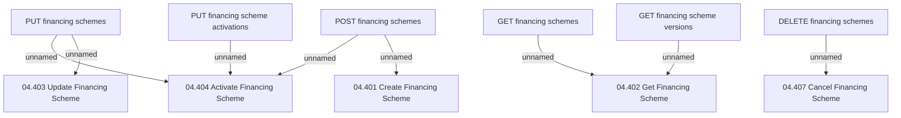

# Access Rights

```mermaid
graph TD
    PUT_financing_scheme_activations["PUT financing scheme activations"]
    n_04_404_Activate_Financing_Scheme["04.404 Activate Financing Scheme"]
    GET_financing_scheme_versions["GET financing scheme versions"]
    PUT_financing_schemes["PUT financing schemes"]
    POST_financing_schemes["POST financing schemes"]
    GET_financing_schemes["GET financing schemes"]
    DELETE_financing_schemes["DELETE financing schemes"]
    n_04_407_Cancel_Financing_Scheme["04.407 Cancel Financing Scheme"]
    n_04_403_Update_Financing_Scheme["04.403 Update Financing Scheme"]
    n_04_402_Get_Financing_Scheme["04.402 Get Financing Scheme"]
    n_04_401_Create_Financing_Scheme["04.401 Create Financing Scheme"]
    PUT_financing_scheme_activations -->|unnamed| n_04_404_Activate_Financing_Scheme
    GET_financing_scheme_versions -->|unnamed| n_04_402_Get_Financing_Scheme
    PUT_financing_schemes -->|unnamed| n_04_403_Update_Financing_Scheme
    PUT_financing_schemes -->|unnamed| n_04_404_Activate_Financing_Scheme
    POST_financing_schemes -->|unnamed| n_04_401_Create_Financing_Scheme
    POST_financing_schemes -->|unnamed| n_04_404_Activate_Financing_Scheme
    GET_financing_schemes -->|unnamed| n_04_402_Get_Financing_Scheme
    DELETE_financing_schemes -->|unnamed| n_04_407_Cancel_Financing_Scheme
```
