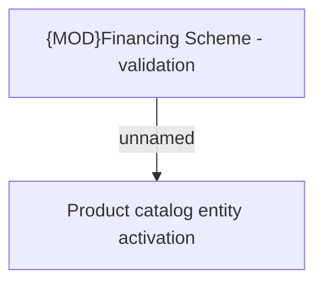

# Validation Rules

```mermaid
graph TD
    Product_catalog_entity_activation["Product catalog entity activation"]
    MOD_Financing_Scheme_validation["{MOD}Financing Scheme - validation"]
    MOD_Financing_Scheme_validation -->|unnamed| Product_catalog_entity_activation
```
