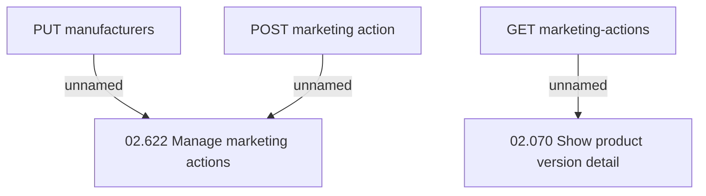

# Access Right

- **Diagram Type**: Custom
- **Package**: HomerSelect/BSL/Modules/Product Catalog (PRC)/Interface Provided/Product Catalog REST API/Marketing Action/Access Right
- **Diagram ID**: 133838
- **Elements**: 5
- **Connectors**: 3

