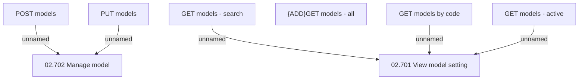

# Access Right

```mermaid
graph TD
    PUT_models["PUT models"]
    POST_models["POST models"]
    GET_models_by_code["GET models by code"]
    ADD_GET_models_all["{ADD}GET models - all"]
    GET_models_active["GET models - active"]
    GET_models_search["GET models - search"]
    n_02_702_Manage_model["02.702 Manage model"]
    n_02_701_View_model_setting["02.701 View model setting"]
    POST_models -->|unnamed| n_02_702_Manage_model
    GET_models_search -->|unnamed| n_02_701_View_model_setting
    GET_models_by_code -->|unnamed| n_02_701_View_model_setting
    GET_models_active -->|unnamed| n_02_701_View_model_setting
    PUT_models -->|unnamed| n_02_702_Manage_model
```
