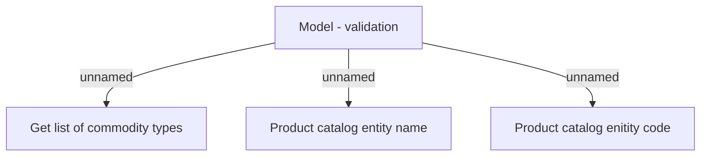

# Validation Rules

```mermaid
graph TD
    Get_list_of_commodity_types["Get list of commodity types"]
    Product_catalog_enitity_code["Product catalog enitity code"]
    Product_catalog_entity_name["Product catalog entity name"]
    Model_validation["Model - validation"]
    Model_validation -->|unnamed| Get_list_of_commodity_types
    Model_validation -->|unnamed| Product_catalog_entity_name
    Model_validation -->|unnamed| Product_catalog_enitity_code
```
