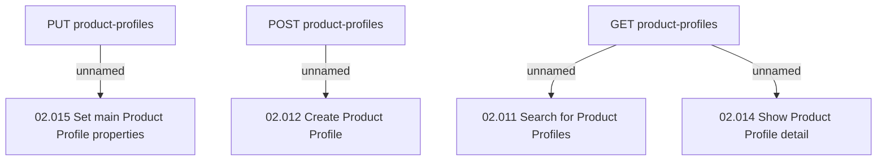

# Access Right

```mermaid
graph TD
    PUT_product_profiles["PUT product-profiles"]
    POST_product_profiles["POST product-profiles"]
    GET_product_profiles["GET product-profiles"]
    n_02_015_Set_main_Product_Profile_properties["02.015 Set main Product Profile properties"]
    n_02_014_Show_Product_Profile_detail["02.014 Show Product Profile detail"]
    n_02_011_Search_for_Product_Profiles["02.011 Search for Product Profiles"]
    n_02_012_Create_Product_Profile["02.012 Create Product Profile"]
    GET_product_profiles -->|unnamed| n_02_011_Search_for_Product_Profiles
    GET_product_profiles -->|unnamed| n_02_014_Show_Product_Profile_detail
    PUT_product_profiles -->|unnamed| n_02_015_Set_main_Product_Profile_properties
    POST_product_profiles -->|unnamed| n_02_012_Create_Product_Profile
```
