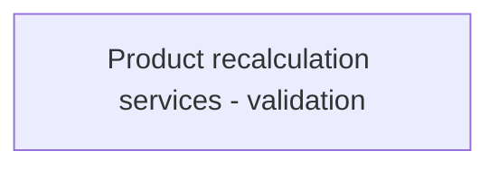

# Validation Rules

- **Diagram Type**: Custom
- **Package**: HomerSelect/BSL/Modules/Product Catalog (PRC)/Interface Provided/Product Catalog REST API/Product Recalculation Data/Validation Rules
- **Diagram ID**: 137279
- **Elements**: 1
- **Connectors**: 0

